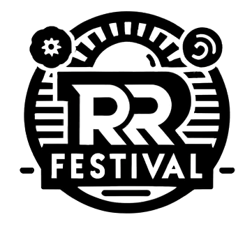
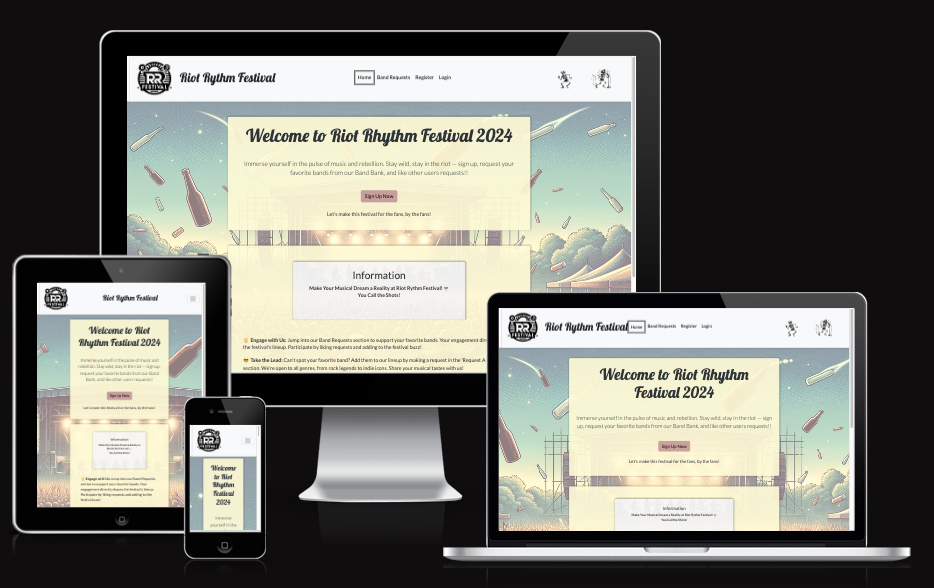
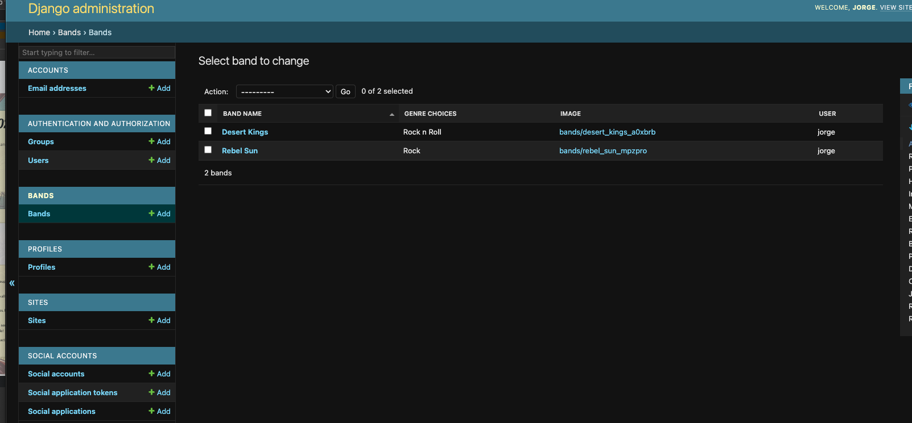
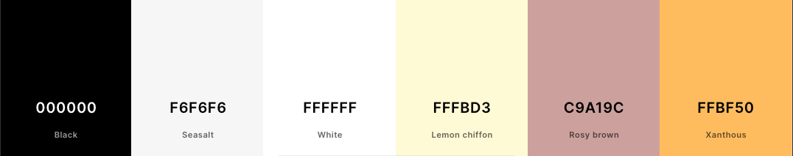
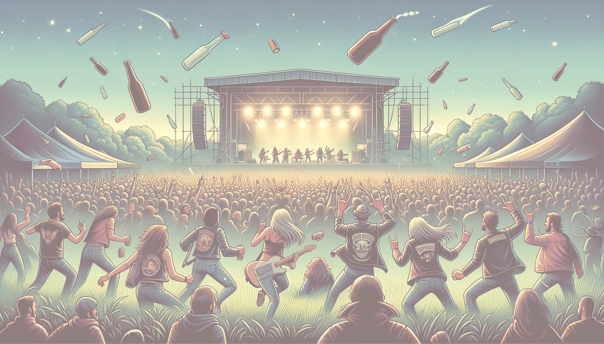
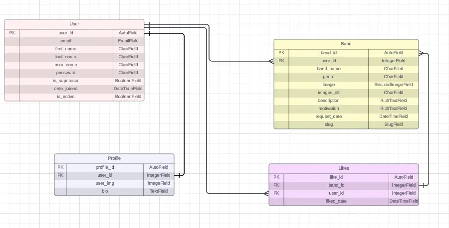

# Riot Rythm Festival 2024




Welcome to Riot Rythm Festival 2024 :studio_microphone:! Here, you'll experience the ultimate musical freedom and create memories that last a lifetime. You, our beloved attendees, are the ones in control. It's you who will determine which bands will take the stage. The more likes your favorite band receives, the greater their chance to perform. This festival is by fans, for fans. So let's come together and create the perfect music experience! :skull:
Link to the live site: [Riot Rythm Festival 2024](https://riotrythm24-feae0f4dbd60.herokuapp.com/)

## Table of Contents
- [Introduction](#introduction)
- [Agile Methodology](#agile-methodology)
- [User Experience (UX)](#user-experience-ux)
  - [The Strategy](#the-strategy)
  - [The Scope](#the-scope)
  - [The Structure](#the-structure)
  - [The Skeleton](#the-skeleton)
  - [The Surface](#the-surface)
- [Am I Responsive](#am-i-responsive)
- [Project Overview](#project-overview)
  - [Learning Objectives](#learning-objectives)
  - [Assignment Requirements](#assignment-requirements)
  - [Self-Assessment](#self-assessment)
- [Features](#features)
  - [Gifs](#gifs)
  - [Future Features](#future-feature)
- [Technologies](#technologies)
  - [Language](#language)
  - [Tools](#tools)
  - [Frameworks & Libraries](#frameworks--libraries)
  - [Design](#design)
- [Data Modeling and Database Design](#data-modeling-and-database-design)
  - [ERD](#erd)
  - [API Integration](#api-integration)
- [Testing](#testing)
  - [Bugs](#bugs)
- [Setup and Deployment](#setup-and-deployment)
  - [Create Repository](#create-repository)
  - [Initialize in VS Code](#initialize-in-vs-code)
  - [Set Up Virtual Environments](#set-up-virtual-environments)
  - [Create Django Project](#create-django-project)
  - [Deployment to Github](#deployment-to-github)
  - [Deployment to Heroku](#deployment-to-heroku)
  - [Local Deployment](#local-deployment)
- [Credits](#credits)
  - [Content](#content)
  - [Images](#images)
  - [Thank You](#thank-you)

## <a id="introduction">Introduction</a>
Welcome to this freedom of music. This is where you will have your best time in 2024.

## <a id="agile-methodology">Agile Methodology</a>
This project is managed using Agile principles tailored for a solo developer, focusing on iterative development and continuous improvement. I utilize a flexible approach to project management that allows for adapting to changes and refining features based on ongoing evaluation and feedback. To help manage tasks and progress, I employ a Kanban board. The link to the board can be found [Here](https://github.com/users/JorgenDIF/projects/4). It provides a visual overview of ongoing, upcoming, and completed work, ensuring that I stay organized and focused on the most critical tasks at hand. This personal agility ensures that the development process remains aligned with the evolving project goals and my learning objectives.

## <a id="user-experience-ux">User Experience (UX)</a>
### <a id="the-strategy">The Strategy</a>
- The core objective is to develop a festival site that is an engaging community hub where users can influence the lineup selection. It will be a fusion of interaction and collaboration, with the following key features:

Included:
1. **User Suggestions via Email:** Users can send direct suggestions for the festival lineup, fostering a sense of personal contribution.
2. **Band Selection from a Bank:** Users choose their preferred bands from a curated list, submitting motivations for their choices, which adds depth to their involvement.
3. **Community Endorsement:** Users can 'like' or support others' band suggestions, creating an interactive and communal decision-making process.
4. **User-Influenced Lineup:** The site will be streamlined to ensure ease of use, aiming to create an exciting and user-influenced festival experience, where the popularity and engagement around bands will guide the organizers in curating the final lineup.

### <a id="the-scope">The Scope</a>
- The project will be a user-centric platform for influencing a festival lineup with the following features:

Included:
1. **User Account Creation:** Allows users to register and engage with band suggestions.
2. **Band Suggestion Submission:** Offers a way for users to propose bands via an online interface or email.
3. **Band Selection:** Lets users pick from a pre-listed selection of bands, providing reasons for their choices.
4. **Likes for Band Suggestions:** Users can show support for other users' band suggestions.
5. **Admin Panel:** Enables administrators to manage band suggestions and user interactions.

Excluded:
- Detailed user analytics, real-time updates, and direct messaging functionalities will not be included in the initial version to maintain simplicity and focus on the core features.


### <a id="the-structure">The Structure</a>
- The project's structure will be organized to facilitate easy navigation and interaction, ensuring that users can quickly understand and engage with the site's functionality.

Main Sections:
1. **Home Page**: Introduces the concept and navigates to main features.
2. **Registration/Login**: For user account creation and access.
3. **Suggestion Form**: Where users can submit their band suggestions.
4. **Band List**: Displays available bands for selection and user submissions.
5. **Like Mechanism**: Associated with each band suggestion for community endorsement.
6. **Admin Dashboard**: Accessible by site administrators for content management and oversight.

Connections:
- The Home Page links to both the Registration/Login section for new users and the Band List for returning visitors.
- The Suggestion Form is directly connected to the Band List, allowing users to view and select from existing options or add new ones.
- Likes for suggestions are immediately reflected on the Band List to showcase popularity.
- The Admin Dashboard has controls to manage the Band List and review submissions from the Suggestion Form.

This logical flow ensures users can seamlessly move from signing up, making suggestions, browsing bands, and interacting with the community's choices.

### <a id="the-skeleton">The Skeleton</a>
The skeleton of the project lays out the wireframes and basic layouts that dictate the user interface's organization and visual flow, including specific areas for general information and administrative functions.

Key Layouts:
1. **Home Page Layout:** Provides a welcoming introduction to the festival concept with direct navigation to other sections.
2. **User Registration/Login Layout:** Features streamlined forms for easy user onboarding or access.
3. **Band Suggestion Layout:** Offers a simple form for users to suggest bands, designed to engage users effectively.
4. **Band List Layout:** Displays suggested and selectable bands with 'like' buttons and motivation texts.
5. **Admin Dashboard Layout:** A functional interface for content management, including user activity and band suggestions.
6. **Information Page Layout:** Delivers detailed information about the festival, guidelines for participation, and general FAQs.
7. **Add Band Layout (Admin Only):** An admin-exclusive layout to input new bands into the system, featuring necessary fields such as band name, genre, and image uploads.

## The Wireframes can be found here:

Home Mobile

<details>
<summary>Click to expand</summary>


</details>

Home Ipad
<details>
<summary>Click to expand</summary>


</details>


Home Laptop
<details>
<summary>Click to expand</summary>


</details>

Add Band Request Mobile

<details>
<summary>Click to expand</summary>


</details>

Add Band Request Laptop

<details>
<summary>Click to expand</summary>


</details>

Add Band Request Ipad

<details>
<summary>Click to expand</summary>


</details>


These layouts and placeholders will guide the development of the user interface. The wireframes, once created and inserted, will illustrate how each page is structured to facilitate user interactions and administrative tasks, ensuring a seamless experience across the platform.

### <a id="the-surface">The Surface</a>
The surface level of the project focuses on the aesthetic and sensory aspects, detailing the design choices including typography, color schemes, and visual elements that enhance the user experience and brand identity of the festival site.

1. **Typography:**
  - Primary Typeface: A modern sans-serif font for headings and user interface elements to convey clarity and accessibility.
  - Secondary Typeface: A contrasting serif font for body text to add a touch of elegance and improve readability.

2. **Color Scheme:**
  - Primary Colors: A vibrant palette that includes electric blue and bright magenta, reflecting the dynamic and energetic nature of a music festival.
  - Secondary Colors: Neutral shades like light gray and off-white to provide balance and ensure content readability.
  - Accent Color: Neon green for calls to action and interactive elements, which stands out against both primary and secondary colors.

3. **Visual Elements:**
  - Icons: Use of bold and thematic icons to direct users and enhance navigation.
  - Images: High-quality images of bands and crowds, giving a real-life feel of the festival atmosphere.
  - Animations: Subtle animations for user interactions like button clicks and transitions to keep the interface lively and engaging.

4. **Layout:**
  - Consistency: Uniform layouts across pages to ensure a seamless user experience.
  - Spacing: Ample spacing between elements to create a clean and organized appearance.
  - Responsive Design: Ensuring the website is fully responsive for optimal viewing on various devices and screen sizes.

5. **User Interface Components:**
  - Buttons: Styled with rounded corners and shadows to provide a tactile feel.
  - Forms: Designed for ease of use with clear labeling and spacious input fields.
  - Menus: Dropdown and hamburger menus for a compact and accessible navigation structure.

These design elements are chosen to create a welcoming and interactive online environment that reflects the festival's vibrant community and provides an engaging user experience. The combination of visual appeal and functional design will make the site not only a tool for interaction but also a pleasing space to explore.

## <a id="am-i-responsive">Am I Responsive</a>
Showing of the responsiveness of the website on different devices.
<details>
<summary>Click to expand</summary>



</details>

## <a id="project-overview">Project Overview</a>
A comprehensive overview of the project, including learning objectives, assignment requirements, and self-assessment.

<summary>Click to expand</summary>

### <a id="learning-objectives">Learning Objectives</a>
What the project aims to achieve in terms of learning and development
1. **Mastery of Django:** Gain deep understanding and hands-on experience with Django, focusing on its ORM, views, templates, and forms.
2. **Proficiency in Bootstrap:** Learn to implement responsive web designs that automatically adjust for different device screens.
3. **Full Stack Development:** Develop front-end and back-end skills to create a comprehensive web application.
4. **Kanban Board Implementation:** Utilize Kanban methodology for effective project management and task tracking.
5. **Project Management and Version Control:** Manage software development using Git for version control, enhancing collaboration and project tracking abilities.
6. **Testing and User Feedback:** Engage in thorough testing practices and gather user feedback to refine the application.
</details>


### <a id="assignment-requirements">Assignment Requirements</a>
A detailed list of project requirements as outlined by the educational curriculum:
<details>
<summary>Click to expand</summary>
1. Functionality: Create a fully functional web application where users can suggest, select, and like bands.
2. User Authentication: Implement secure user registration and login capabilities.
3. Database Management: Design and utilize a database to store user data and band information.
4. Responsive Design: Ensure the website is responsive and accessible on all devices.
5. User Interface: Develop a clean and intuitive user interface using Bootstrap.
6. Project Documentation: Maintain comprehensive documentation of the development process and code.
7. Version Control: Use Git to manage the project repository, with consistent commits and clear commit messages.
8. Kanban Board: Set up and maintain a Kanban board for task management throughout the project duration.
</details>

### <a id="self-assessment">Self-Assessment</a>

<details>
<summary>Click to expand</summary>
1. **Learning Reflection:**
The journey through this project has deepened my appreciation for the robustness of Django and the utility of Bootstrap in creating responsive designs. As I navigated the intricacies of these technologies, I've learned to leverage their strengths to build a more efficient and detailed application.

2. **Highlights:**
The integration of Django's powerful ORM and Bootstrap's responsive front-end components was particularly rewarding. This combination allowed me to efficiently handle both the aesthetic and functional aspects of web development, enhancing user experience significantly.

3. **Challenges:**
While I have become more proficient in using Django and Bootstrap, I find that backend development, particularly optimizing database interactions and server-side logic, remains my biggest challenge. The depth of Django's features, although beneficial, also introduces a complexity that I am still mastering.

4. **Achievements:**
Developing a full-stack application that effectively utilizes both client-side and server-side technologies to deliver a functional and user-friendly experience is an accomplishment I am proud of. This project has significantly contributed to my understanding and skills in web development.

5. **Areas for Improvement:**
There is considerable room for enhancement in my backend development skills. I plan to focus on better understanding and optimizing database management and server-side processing to improve application performance and scalability. Further practice and study will be essential for me to achieve greater efficiency and robustness in my backend solutions.


</details>


## <a id="features">Features</a>

### <a id="gifs">Gifs</a>

The gifs below show the features of the website.


- The Landing page
<details>
<summary>Click to expand</summary>


</details> <br>


- The Registration page
<details>
<summary>Click to expand</summary>


</details> <br>

- The Login/Log out page

<details>
<summary>Click to expand</summary>


</details> <br>

- Request a Band

<details>
<summary>Click to expand</summary>


</details> <br>

- Edit a Band Request

<details>
<summary>Click to expand</summary>

.gif>)

</details> <br>

- Delete a Band Request

<details>
<summary>Click to expand</summary>


</details> <br>

- Like a Band Request

<details>
<summary>Click to expand</summary>


</details> <br>


- Edit Profile

<details>
<summary>Click to expand</summary>


</details> <br>

- The Admin Panel

Image of the Admin Panel

<details>
<summary>Click to expand</summary>



</details> <br>

### <a id="future-feature">Future Features</a>

1. Most liked band shown on the main page. Like a list
2. Tickets buying system
3. Schedule of the festival
4. User been able to create a cosutm schedule
5. Merchandise store
6. Music of the bands
7. Videos of the bands


## <a id="technologies">Technologies</a>
### <a id="language">Language</a>
- **HTML:** Utilized for structuring the web content and layout of the application.
- **CSS:** Employed to style the visual presentation of the web pages.
- **JavaScript:** Used to add interactivity to the web application, including dynamic behavior in Bootstrap-powered navbars and other UI elements.
- **Python:** The primary programming language used, serving as the backbone for server-side logic.
- **Django:** Although not a programming language, Django is a high-level Python web framework that encourages rapid development and clean, pragmatic design. It was used extensively for ORM, routing, views, and templating.
- **Bootstrap:** This framework was used to create responsive and mobile-first front-end web designs. It simplifies the implementation of complex visual layouts and enhances interactivity when paired with JavaScript.
- **PostgreSQL:** Chosen for database management, this robust system supports both standard and custom data types, making it ideal for complex data-driven applications.

### <a id="tools">Tools</a>
Development and Maintenance Tools:

1. **Visual Studio Code (VS Code):** A versatile code editor that supports HTML, CSS, JavaScript, and Python, offering useful extensions for Django development.
2. **Git:** Used for version control to manage source code history.
3. **GitHub:** Hosts the project repository, facilitates collaboration, issue tracking, and code review. Also used for managing tasks with a Kanban board interface.
4. **Django Development Server:** Used for local development and testing; comes integrated with Django.
5. **PostgreSQL from Code Institute:** The primary database system used for managing all data persistence, configured and provided as part of the educational curriculum.
6. **Heroku:** A cloud platform as a service (PaaS) used to deploy the web application, allowing it to be accessed on the internet.
7. **Lucidchart:** Employed to create and manage the Entity-Relationship Diagram (ERD) that visually represents the database schema.
8. **Balsamiq:** Used to create wireframes during the design phase, helping to visualize the layout and user interface of the web application before development.
9. **Cloudinary:** A cloud-based service used to efficiently manage, upload, and deliver images across the web application, enhancing performance and scalability.

### <a id="frameworks--libraries">Frameworks & Libraries</a>
Details on the frameworks and libraries integrated into the project:
1. **Bootstrap:** Utilized via CDN to ensure the latest version of this front-end framework for designing responsive and mobile-first websites. Bootstrap's components and utilities have been extensively used along with JavaScript to enhance interactivity and the overall user experience. This integration allows dynamic behaviors like collapsible menus and modal windows, which are crucial for a modern, responsive web interface.

2. **Django:** A high-level Python web framework used for rapid development and clean, pragmatic design. Integrates with Django Admin for database management.

3. **Python Package Index (PyPI):** Source for all the third-party Django and Python libraries used in the project.


### <a id="design">Design</a>
Design of the project:
- **Color Scheme:** The color scheme is simple and the colors in the boxes and on the buttons are catching colors from the background image.

<details>
<summary>Click to expand</summary>



</details> <br>

- **The background image:** The background image is a festival of an audience. Almost in a Riot. I've given it an opacity of 0.5 to make the text more readable.

<details>
<summary>Click to expand</summary>



</details> <br>

- **Typography:** The fonts used are 'Lato' for the body text and 'Lobster' for the festival name.

## <a id="data-modeling-and-database-design">Data Modeling and Database Design</a>
Entity Relationship Diagram showing the database schema.

<details>
<summary>Click to expand</summary>

### <a id="erd">ERD</a>

</details> <br>


### <a id="api-integration">API Integration</a>
### Cloudinary API

The project uses the [Cloudinary](https://cloudinary.com/) API for handling media files like images and videos. The API key is stored in `env.py` for security purposes.


## <a id="testing">Testing</a>
- A separate document, TEST.md, contains detailed test cases and results.
[Link to TEST.md](TEST.md)
### <a id="bugs">Bugs</a>
Documentation of known bugs and their status.
All known bugs are in the [Kanban Board](https://github.com/users/JorgenDIF/projects/4) under the "Bugs" column.


## <a id="setup-and-deployment">Setup and Deployment</a>
### <a id="create-repository">Create Repository</a>
Step-by-step guide on creating a new repository from the Gitpod Full Template by Code Institute.
<details>
<summary>Click to expand</summary>

**Log in to GitHub:**
1. Open your web browser and navigate to GitHub.
2. If you are not already logged in, enter your GitHub username and password to log in.

**Access the Gitpod Full Template:**
1. Go directly to the Gitpod Full Template repository.

**Create a New Repository Using the Template:**
1. On the template repository page, look for the green button that says "Use this template". Click on this button.
2. You will be redirected to the "Create a new repository from gitpod-full-template" page.

**Configure Your New Repository:**
1. Repository name: Enter a name for your new repository.
2. Repository description (optional): Provide a brief description of your repository.
3. Privacy settings: Choose whether the repository should be Public (anyone can see this repository) or Private (you choose who can see this repository).
4. Leave the "Include all branches" checkbox unchecked if you just need the main branch; check it if you need all branches from the template.

**Create the Repository from the Template:**
1. Click the "Create repository from template" button to create your new repository with the contents of the Gitpod Full Template.

**Access Your New Repository:**
1. Once the repository is created, you will be redirected to your new repository page on GitHub.

### <a id="initialize-in-vs-code">Initialize in VS Code</a>

Clone in VSCode:
1. Open VSCode.
2. Press Ctrl + Shift + P (Cmd + Shift + P on macOS) to open the Command Palette.
3. Type Git: Clone and select it.
4. Paste the repository URL and press Enter.
5. Select a directory to save the repository on your local machine.
6. After cloning, a prompt will ask if you want to open the cloned repository. Click “Open”.

</details>

### <a id="set-up-virtual-environments">Set Up Virtual Environments</a>
Requirements:
<details>
<summary>Click to expand</summary>

**1. Python 3.x installed on your system.**

**Steps:**

**1. Open Your Command Line Interface:** This could be Terminal on macOS/Linux or Command Prompt on Windows.
**2. Navigate to Your Project Directory:** Enter `cd path/to/your/project` to move into your project directory.
**3. Create the Virtual Environment:**
  - On Windows, type `python -m venv .venv`
  - On macOS or Linux, type `python3 -m venv .venv`
  This command creates a folder named `.venv` in your project directory containing the virtual environment.
**4. Activate the Virtual Environment:**
  - On Windows, type `.venv\Scripts\activate`
  - On macOS or Linux, type `source .venv/bin/activate`
  Activation changes the shell to use the environment’s settings and packages.
**5. Install Dependencies:**
  Once the environment is activated, install any required packages using `pip install package-name`.
**6. Capture Installed Dependencies:**
  To create a `requirements.txt` file that lists all installed packages, use `pip freeze > requirements.txt`. This file can then be used to install all necessary packages into another environment or shared with other developers.
**7. Deactivate the Virtual Environment:**
  When finished, you can deactivate the environment by typing `deactivate`.
  </details>

### <a id="create-django-project">Create Django Project</a>
Step-by-step guide on how to create a new Django project.
<details>
<summary>Click to expand</summary>

1. Install Django: Ensure you have Django installed on your system. If not, you can install it using pip:
  ```
  pip install django
  ```

2. Create a New Django Project: Use the django-admin command to create a new Django project. Replace `project_name` with the desired name for your project:
  ```
  django-admin startproject project_name
  ```

3. Navigate to the Project Directory: Change into the newly created project directory:
  ```
  cd project_name
  ```

4. Create a Virtual Environment (Optional): It's good practice to work within a virtual environment. You can create one using virtualenv:
  ```
  virtualenv venv
  ```

  Activate the virtual environment:
  - On Windows:
    ```
    venv\Scripts\activate
    ```
  - On Unix or MacOS:
    ```
    source venv/bin/activate
    ```

5. Initialize Git (Optional): If you're using version control with Git, initialize a new Git repository:
  ```
  git init
  ```

6. Create .gitignore File (Optional): Create a .gitignore file to specify which files and directories Git should ignore. Typically, this includes the `venv` directory, database files, and sensitive configuration files.

7. Set Up Environment Variables: Create an `env.py` file to store sensitive information like secret keys and API keys. Add this file to your `.gitignore` to prevent it from being pushed to your repository. An example `env.py` file might look like this:
  ```python
  import os

  os.environ.setdefault('SECRET_KEY', 'your_secret_key_here')
  os.environ.setdefault('DEBUG', 'True')
  ```

  Replace `'your_secret_key_here'` with a randomly generated secret key.

8. Configure Django Settings: Update the Django settings (`settings.py`) to use environment variables. For example, you can set the `SECRET_KEY` and `DEBUG` variables like this:
  ```python
  import os

  SECRET_KEY = os.environ.get('SECRET_KEY')
  DEBUG = os.environ.get('DEBUG') == 'True'
  ```

  Ensure to import `env` at the top of `settings.py` to load environment variables.

9. Run Migrations: If your project uses a database, apply initial migrations:
  ```
  python manage.py migrate
  ```

10. Start the Development Server: Finally, start the Django development server to verify that everything is set up correctly:
   ```
   python manage.py runserver
   ```

   Open a web browser and navigate to http://127.0.0.1:8000 to see your new Django project in action.

</details>


### <a id="deployment-to-github">Deployment to Github</a>

<details>
<summary>Click to expand</summary>
1. Add Files to Git: Navigate to your project directory in the terminal and add all your project files to the staging area by running:
  ```
  git add .
  ```

2. Commit Changes: Commit the staged files with a descriptive message to track changes. For example:
  ```
  git commit -m "Initial commit: Added Django project files"
  ```

3. Push to GitHub: Push your local repository to GitHub:
  ```
  git push
  ```
  </details>

### <a id="deployment-to-heroku">Deployment to Heroku</a>
Detailed procedure for deploying the project on Heroku.


## <a id="credits">Credits</a>
### <a id="content">Content</a>
The project is inspired by this [Dee Mac Recepie Tutorial](https://www.youtube.com/watch?v=sBjbty691eI&list=PLXuTq6OsqZjbCSfiLNb2f1FOs8viArjWy)


The like model was made by sutying this [Stackoverflow](https://stackoverflow.com/questions/62879957/how-to-implement-a-like-system-in-django-templates) post

To count the likes I followed this [Stackoverflow](https://forum.djangoproject.com/t/get-total-count-of-objects-to-display/13175 ) post

I also used [Django Official Documentation](https://www.djangoproject.com/) to learn more

To collect the static files I followed the Walkthrough project from Code Institute

For translation from swedish to english I somtetimes used Chat GPT from OpenAI

### <a id="images">Images</a>
All the images in this project is made by CHat GPT from OpenAI

### <a id="thank-you">Thank You</a>
- My Mentor Dick Vlaanderen for the amazing help along the way
- My Wife and family for the support and understanding
- Slack community and mainly the Swedish Channel for the love and help. It's truly special


