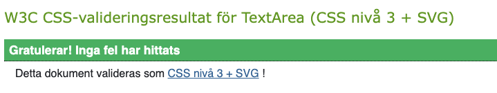
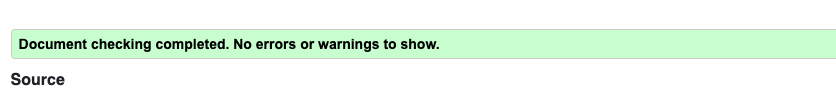
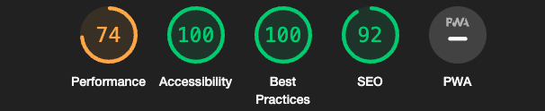
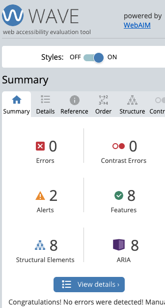
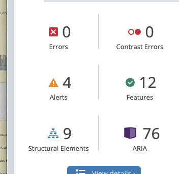
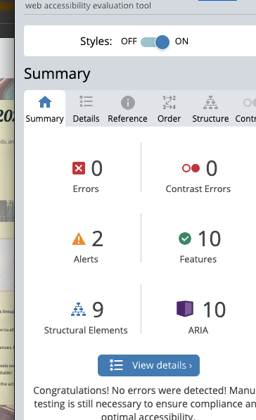

### This is the tests document for the Riot Rythm project.

## Manuel Testing of the functions

| Test Case        | Expected Result  | Actual Result | Pass/Fail |
|------------------|------------------|---------------|-----------|
| Home Link        | Home page loads without errors | Home page loaded without errors | Pass |
| Band Requests Link | Band Requests page loads without errors | Band Requests page loaded without errors | Pass |
| Register Link | Register page loads without errors | Register page loaded without errors | Pass |
| Login Link | Login page loads without errors | Login page loaded without errors | Pass |
| Registration Functionality | User is required to fill in all fields. If a field is missed, an error is shown. | User was required to fill in all fields. An error was shown when a field was missed. | Pass |
| Registration Completion | User is able to complete registration successfully with valid data and is redirected to the login page. | User was able to complete registration successfully with valid data and was redirected to the login page. | Pass |
| Login Functionality | User is able to login successfully with correct credentials and is redirected to the home page. | User was able to login successfully with correct credentials and was redirected to the home page. | Pass |
| Logout Functionality | User is logged out and redirected to the login page. A confirmation message is shown. | User was logged out and redirected to the login page. A confirmation message was shown. | Pass |
| Add Band | User is required to fill in all fields in the band part. If a field is missed, an error is shown. | User was required to fill in all fields in the band part. An error was shown when a field was missed. | Pass |
| Add Band Completion | User is able to add a band successfully with valid data and the band shows up in the band list. | User was able to add a band successfully with valid data and the band showed up in the band list. | Pass |
| Band Requests | User is able to open band requests successfully and can see the list of band requests. | User was able to open band requests successfully and could see the list of band requests. | Pass |
| Band Request Detail View | User is able to click on a band request and is taken to the detail view of that request. | User was able to click on a band request and was taken to the detail view of that request. | Pass |
| Edit Own Request | User is able to edit their own band request successfully. | User was able to edit their own band request successfully. | Pass |
| Delete Own Request | User is able to delete their own band request successfully. | User was able to delete their own band request successfully. | Pass |
| Confirm Delete | User is asked for confirmation before deleting their own band request and the request is deleted after confirmation. | User was asked for confirmation before deleting their own band request and the request was deleted after confirmation. | Pass |
| Like Band | User is able to like a band successfully and a like is added to the band. | User was able to like a band successfully and a like was added to the band. | Pass |
| Profile View | User is able to press the profile button and view their profile. | User was able to press the profile button and view their profile. | Pass |
| Edit Profile | User is able to press the edit button on their profile and the edit option opens up. | User was able to press the edit button on their profile and the edit option opened up. | Pass |
| Confirm Edit Profile | User is able to confirm their profile edits successfully and the changes are saved. | User was able to confirm their profile edits successfully and the changes were saved. | Pass |
| Edit Others' Band Request | User should not see the edit button for other users' band requests. | User did not see the edit button for other users' band requests. | Pass |
| Like Band More Than Once | User should not be able to like a band more than once. | User was not able to like a band more than once. | Pass |
| Add Band Request Button Visibility | The "Add Band Request" button should not be visible if the user is not logged in. | The "Add Band Request" button was not visible when the user was not logged in. | Pass |

## Validation Testing

- Css Validation: No errors found.  

 

- HTML Validation: No errors found  
  

- Python Validation: No errors found.  

  

- JavaScript Validation: No errors found on jshint.com.  

## LightHouse Testing

This is my lighthouse Result

## Browser Testing

The application was tested across multiple browsers (Safari, Edge, Chrome) and on multiple devices (Mobile, iPad) to ensure compatibility and responsiveness. The application was found to be functioning as expected on all tested platforms.

| Browser/Device | Test Result |
|----------------|-------------|
| Safari         | Pass        |
| Edge           | Pass        |
| Chrome         | Pass        |
| Mobile         | Pass        |
| iPad           | Pass        |

## Wave Testing

The application was tested using the WAVE tool to ensure accessibility. The application was found to be accessible with no errors just a few alerts about the images and home button has the same links which is on purpose

